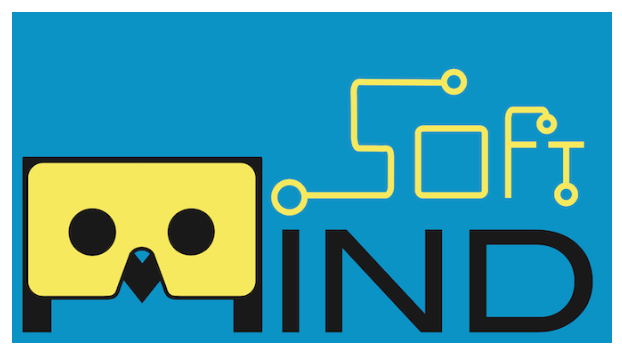
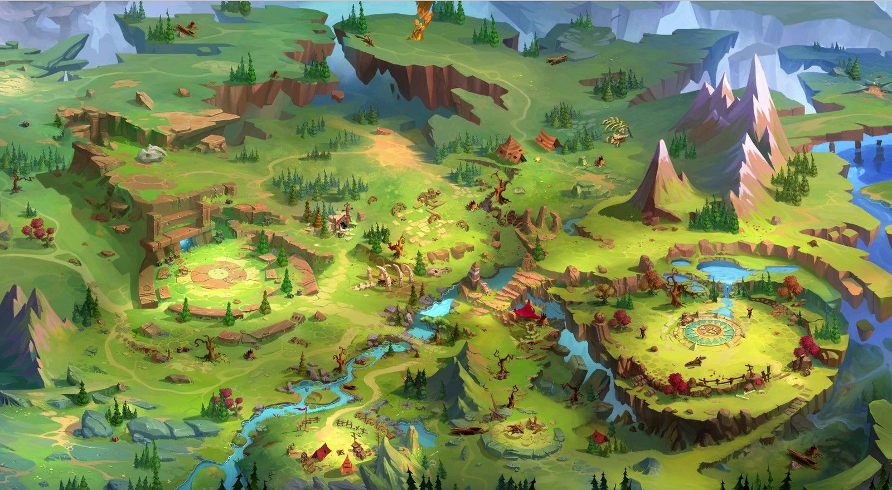

# 3 Web 15 mois cours creative coding avancé

## Le cours se compose en 3 étapes :
- Navigation Drag & Drop et Slides de la carte
- Réalité augmentée
- Prototype final

---

## Cours du 22 octobre 2024

### Drag & drop 1
- Déplacer en drag & drop la carte sur l'axe x : exemple dans le ficher `dragdrop1.html`
 

### Drag & drop 2
- Déplacer la carte en drag & drop sur tous les axes `dragdrop2.html`

### Slides
- Swiper dans les parties de la carte `slides1.html` : solar system map
- Swiper dans les parties de la carte `slides2.html` : brain map

### Ajout d'une scrollbar : 

        .swiper-scrollbar {
            background: rgba(255, 255, 255, 0.1);
            height: 8px !important;
            border-radius: 4px;
        }

        .swiper-scrollbar-drag {
            background: rgba(255, 255, 255, 0.5);
            border-radius: 4px;
            transition: background 0.3s ease;
        }

        .swiper-scrollbar-drag:hover {
            background: rgba(255, 255, 255, 0.8);
        }'

---

## Utilisation de la réalité augmentée

##### L'animation avec Mind AR
Test AR avec la librairie [MindAR](https://hiukim.github.io/mind-ar-js-doc/)

### SOFT MIND : 

-test avec la carte Softmind sur `rabasic.html`

*image cible qui affiche soft mind*

### Démo personnalisée avec une seule cible

-Avec la carte sur `raperso.html`

*image cible qui affiche étoile mario*

### Démo personnalisée avec plusieurs cibles

-Avec la carte sur `ramultitargets.html`

*image cible01 qui affiche l'objet 3D lapins*

*Démo image 1 map*

*image cible02 qui affiche l'objet 3D creeper*

*Démo image 2 désert*

